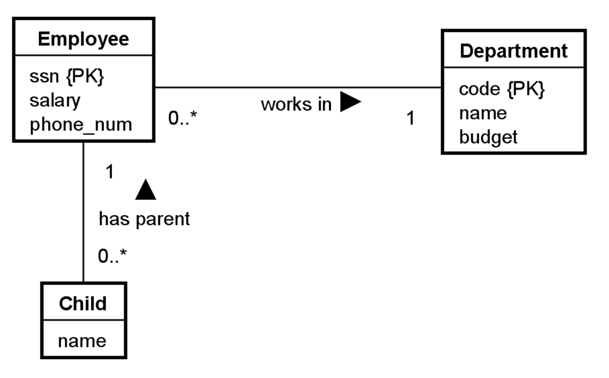
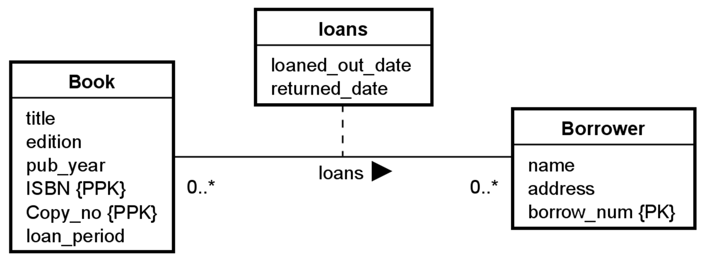
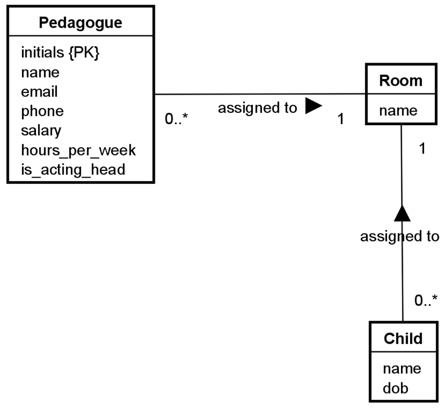
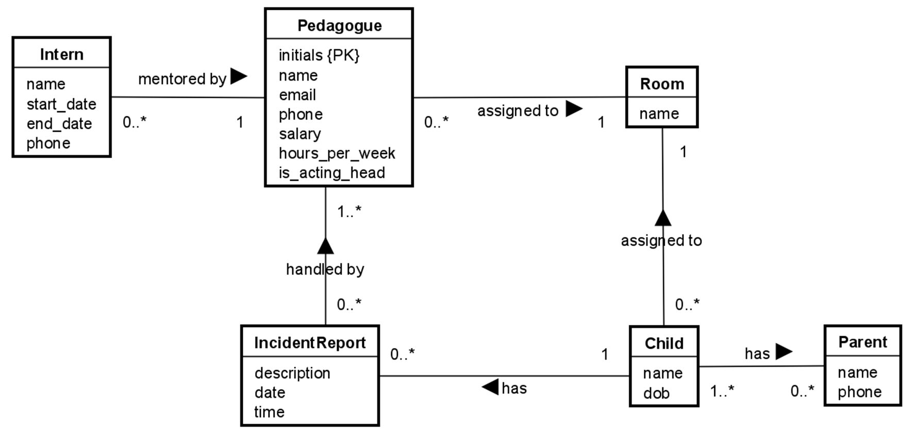
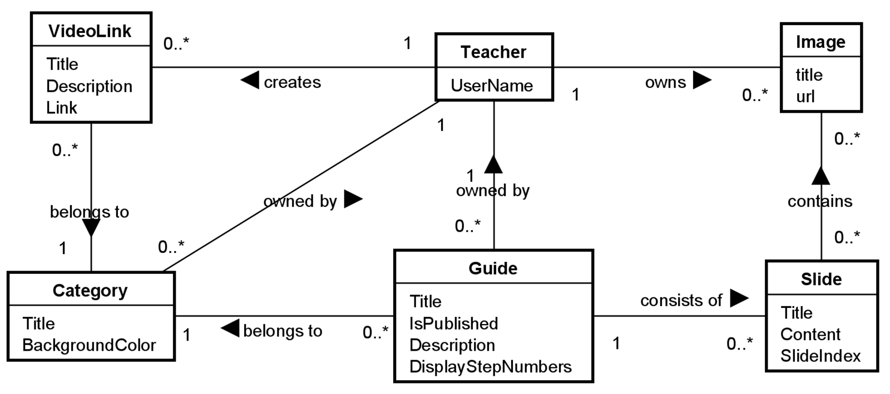

# 10 Exercises: EFC Introduction

## 10.1 Getting started

For our first exercise, lets start with a pretty simple example.

We want to end up with a database, generated by EFC, based on our entities.

That is, we don't want to write any SQL ourselves, everything database related should be handled by EFC.

**Objective:**  
Get familiar with EFC, and how a "code first" approach can be used to generate a database.

**Task:**  
Implement the above diagram using EFC.

**Steps:**

1. Create a new solution
2. Create a new CLI project
3. Follow the [installation guide](https://troelsmortensen.github.io/CodeLabs/Tutorials/EfcSetupIntro/Page.html)
4. Create entities
5. Configure relationships
6. Create/Setup PKs
7. Generate migration
8. Create database

<blockquote>

Display solution...

</blockquote>

## 10.2 Simple Library

Here is another diagram, with a relationship attribute

**Objective:**  
Understand how relationship attributes can be implemented.

**Task:**  
Implement the above diagram using EFC.

**Steps:**

1. Create a new CLI project
2. Create entities
3. Configure relationships
4. Create/Setup PKs
5. Generate migration
6. Create database

<blockquote>

Display solution...

</blockquote>

## 10.3 Migrations

Another diagram, this time in two parts

**Objective:**  
Get familiar with migrations, and how we can evolve our database, as we implement more entities.

**Task:**  
Implement the above diagram using EFC.

**Steps:**

1. Create a new CLI project
2. Create entities
3. Configure relationships
4. Create/Setup PKs
5. Generate migration
6. Create database
7. Expand on your solution by implementing the following diagram, and generate migrations and update

<blockquote>

Display solution...

</blockquote>

## 10.4 Advanced example

This diagram contains a bit of everything

**Objective:**  
Challenge yourself by implementing a larger scale system.

**Task:**  
Implement the above diagram using EFC.
You could try to generate parts of the diagram, bit by bit, or everything in one go.

**Steps:**

1. Create a new CLI project
2. Create entities
3. Configure relationships
4. Create/Setup PKs
5. Generate migration
6. Create database

<blockquote>

Display solution...

</blockquote>
