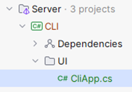

# Table of Contents:

 - [Part 1 - Entities & Repositories](#part-1---entities--repositories)
    - [Step 1.1 - Requirements](#step-11---requirements)
    - [Step 1.2 - Create Solution](#step-12---create-solution)
    - [Step 1.3 - GitHub](#step-13---github)
    - [Step 1.4 - Domain Model](#step-14---domain-model)
    - [Step 1.5 - Entities](#step-15---entities)
    - [Step 1.6 - Implement your entities](#step-16---implement-your-entities)
    - [Step 1.7 - Repositories](#step-17---repositories)
    - [Step 1.8 - Repository Contracts Project](#step-18---repository-contracts-project)
    - [Step 1.9 - In-memory Repository Implementations](#step-19---in-memory-repository-implementations)
    - [Step 1.10 - Formalities](#step-110---formalities)
 - [Part 2 - Some more stuff](#part-2---command-line-interface)
    - [Step 2.1 - Requirements](#step-21---requirements)
    - [Step 2.2 - Status](#step-22---status)
    - [Step 2.3 - Setup](#step-23---setup)
    - [Step 2.4 - Dependencies](#step-24---dependencies)
    - [Step 2.5 - UI Class](#step-25---ui-class)
    - [Step 2.6 - Implement CLI Application](#step-26---implement-cli-application)
    - [Step 2.7 - Business Logic](#step-27---business-logic)
    - [Step 2.8 - Asynchronous Programming](#step-28---asynchronous-programming)
    - [Step 2.9 - Formalities](#step-29---formalities)
 - [Part 3 - Some more stuff](#part-3---some-other-stuff)
 - [Part 4 - Some more stuff](#part-4---some-other-stuff)
 - [Part 5 - Some more stuff](#part-5---some-other-stuff)
 - [Part 6 - Some more stuff](#part-6---some-other-stuff)
 - [Part 7 - Some more stuff](#part-7---some-other-stuff)


# Part 1 - Entities & Repositories

In this assignment series you will build out a small forum app. 

For each assignment you will add something new to the project, and at the end of the semester you will have a fully working forum app (hopefully...). 

It will consist of a simple CRUD focused Web API, with Entity Framework Core and a SQLite database to store data. 

For the front-end you will have a Blazor web app.

In this first assignment you will create the entities for your domain model, and you will define repository interfaces (repository is explained later).

Because your app will evolve over time (different parts will be added and swapped out) we need to design the system with modularity in mind. 

We do this by creating multiple *projects*, each responsible for something specific. It will be a simplified layered application.

**The Web API** (i.e. server) will contain two layers; a network layer and a persistence layer. 

Often you will have a business logic layer in between, but we are skipping that, and simplifying the server to focus on the .NET tools rather than good SOLID architecture design. 

You should probably have this extra layer in your semester project.

There is some initial setup, which is best done on one computer, then shared to others through GitHub. 

I recommend reading through the entire document before actually starting on anything.

## Step 1.1 - Requirements
This assignment is open-ended, meaning we provide you with a few minimum requirements, which must be completed. We also have suggestions on how to expand upon the system, should you wish to. Or you can come up with your own ideas.

### Feature description
We need a User, having at least user name, and a password. It needs an Id of type int.
We need a Post. It is written by a User. It contains a Title and a Body. It also needs an Id, of type int.
A User can also write a Comment on a Post. A Comment just contains a Body, and an Id of type int.

All entities must have an Id of type int.
The way we create relationships between the Entities is described in detail further below. In short, we use foreign keys, rather than associations.

### Optional features
Further feature suggestions, if you are brave:
•	A user can like/dislike a post.
•	A user can like/dislike a comment.
•	A user can create a SubForum, meaning a post now belongs to a specific SubForum instead.
•	A user can comment on a comment.
•	A user becomes moderator of a sub forum, they created, meaning they can delete comments and posts.
•	Feel free to add further ideas yourself.

## Step 1.2 - Create Solution
First, you need a new, fresh solution. You may work in groups, so only one group member does the initial setup.
Create a new Solution in Rider:
 


And then:
1)	Select Empty Solution
2)	Give your solution a name
3)	Place it somewhere
4)	Create a new directory, this is probably checked already
5)	Check this to create a git repository. You must have your assignment on GitHub, and hand in a link to your repository. It’s easier if this is checked initially, then you get some extra setup prepared for you, like a git ignore file.
 


Now you should have a new, fresh, empty solution.
## Step 1.3 - GitHub
You must use Git and GitHub for your assignments. You may use whatever branching strategy, you like. Each hand-in on itslearning is typically a link to your main branch. 
A good start is to now commit your *.sln file. E.g.: DnpAssignmentXYZ.sln. This file ”binds” your entire application together.
## Step 1.4 - Domain Model
Based on the above requirements, you must create a domain model diagram, where we can see:
•	The entities of the system
•	The properties (attributes) on the entities
•	The relationships between entities, e.g. Post is written by a User. Remember multiplicities at both ends. Like you were taught for the Entity Relationship Diagram in DBS, or the Domain Model in SWE. 

## Step 1.5 - Entities
It’s time to implement the domain model, i.e. the entities as classes. These will just be data container classes, using properties. 
First, create a new Solution Folder, call it Server. This folder will contain all server related code:
 


Now, your solution looks like this:
 
 

Then, create a new class library to contain your domain entities, inside the Server folder:
 


Then, setup the project as follows:
1)	Select Class Library
2)	Give the project a name
3)	Specify the directory, i.e. put this project into Server
4)	Select SDK and Framework, if available. If you only have one version installed, these are probably greyed out, or not there at all.
5)	Select Create
 


Now your solution looks like this:
 


You can safely delete the Class1.cs file inside Entities. 
Now, you can create your entities, e.g. Post, User, etc, in this project:
 
 

Remember, all your classes should be under git version control. But you must also tell git about your projects.
This is done by adding and committing the *.csproj file for each project.
Initially, a new project will have its name in red font, meaning git does not know about it. E.g.:
 


You must then find the *.csproj file and add it. First, change the view from ”Solution” to ”File system”:
 


Then add the .csproj file in the project to git:
 
 

Do this for your Entities library project.

### Entity Relationships Modelling
You are used to model relationships with associations, e.g. a Post has many Comments. Then the Post would have a List of Comments.
We don’t initially do this. It comes later in the course.

> [!IMPORTANT]
> DON’T DO ASSOCIATIONS NOW

We use the approach of a relational database, and model our entity-relationships using foreign keys.
This means a Comment will have a property called PostId, which references the post, that the comment belongs to.
A Post might have a SubForumId, which references the Sub Forum it belongs to. If you make this feature.
A Post will also have a UserId property, referencing the User, which wrote the post. Similar for the Comment. And so on.
Here is what your Post might initially look like. We use auto-properties instead of field variables! This is important!
 
```csharp
public class Post
{
    public int Id { get; set; }
    public string Title { get; set; }
    public string Body { get; set; }
    public int UserId { get; set; }
}
```

You may add constructor(s) if you find this needed. It will be later, and it will then be explained how to do it. Or you can just use the object initializer approach.

## Step 1.6 - Implement your Entities
Implement all your entities now.


## Step 1.7 - Repositories
Repository pattern is similar to Data Access Pattern, if you are familiar with that. 
A Repository is an abstraction of data-access for a single entity. This means a Repository is an interface, and the implementation manages how to persist a specific entity-type, somehow. We will initially use a List (i.e. no actual persistence), then a file, and then a database, as we progress through the course.
The Repository interface comes in different shapes, but it will generally provide some standard methods, usually like Create, Read, Update, Delete (i.e. CRUD for short), though maybe renamed.
The Command Line Interface (assignment 2) and Web API (assignment 4) will use a Repository to save incoming data, or extract requested data, etc.
Both the ”presentation/network” layer, and the persistence layer will change over time, but the Repository-interfaces remain the same. This means they must live in their own respective project. It becomes similar to the layered architecture you have seen on second semester, and each project becomes a layer. Sort of.

## Step 1.8 - Repository Contracts Project
The Repositories live on the server side, and is only used on the server side.
We need a project to house the Repository interfaces, aka ”contracts”. The actual implementations will go elsewhere, later.
Create a new Class Library Project, first:
 


And then setup the project:
1)	Select type
2)	Input project name
3)	Update the path, so the project is located in a ”Server” folder.
4)	Select versions
5)	Select to create


 
And finally the new solution structure:
 


You can, again, delete Class1.cs. And put the RepositoryContracts.csproj file under version control, like before with the Entities project.

### Add Reference
The new RepositoryContracts project need to work with your entities. These are located in a separate project, and so we need to add a reference from RepositoryContracts to Entities.
Right click on the ”Dependencies” inside RepositoryContracts.
 


And then select the project, you want to referece, in our case the Entities:
 


Finally, select [Add].
Note: In the image above, it says <Shared>. In yours it says <Server>.

### Create Repository Interfaces
In this project you put Repository interfaces. One for each entity. And you will have at least 3 entities: Post, User, Comment. Maybe more, if you decide to expand your application with more features.
Our repository interfaces will define 5 standard methods:
1)	Add – Used to store a new post
2)	Update – Used to update an existing.
3)	Delete – Delete an existing post.
4)	GetSingle – Get a single post.
5)	GetMany – Get multiple posts.

Here is an example for the IPostRepository interface. The others look almost identical:

```csharp
public interface IPostRepository
{
    Task<Post> AddAsync(Post post);
    Task UpdateAsync(Post post);
    Task DeleteAsync(int id);
    Task<Post> GetSingleAsync(int id);
    IQueryable<Post> GetMany();
}
```

For now, ignore the Task return types, and the ”Async” method name suffixes. This will be explained later.
Method descriptions:

**Add** takes a Post, and returns the created Post. This is because the server sets some data on the Post, e.g. the ID, and this should be returned to the client. The client might need this ID for something. This is common.

**Update** takes a Post (with ID), and just replaces the existing Post. If no existing Post is found, an exception is thrown to indicate the error.

**Delete** will remove the Post with a given ID. If no matching Post is found, an exception is thrown.

**GetSingle** will return the Post matching the given ID. If no Post is found, an exception is thrown.

**GetMany** will return an IQueryable. This is an interface which can looped over in a for-each loop to extract the relevant entities. Or we can use LINQ, which we will see later in the course. 
This makes filtering the Posts by some criteria easier (using predicates, later). 
Maybe we want to fetch all Posts with a specific sub-string in the postname. Or some other property on the Post.
The method is not async, the reason of which we will get back to, when we add a database.

> [!IMPORTANT]
> You will define such an I*Repository interface per entity!

### What is Task and Async?
We will come back to this in session 2. It is asynchronous programming. It’s an optimization approach, so that different tasks/jobs/pieces of code can automatically be executed in parallel. Sort of like automatic multithreading. It is just managed for us, instead of us having to explicitly create threads.
It requires us to return a Task, sometimes wrapping the actual value, e.g. Task<User>. This is a Task which will eventually return a User. We can then extract the User from the Task, when the Task is finished.
By convention asynchronous methods have their method names suffixed with ”Async”, to indicate they are used differently from normal methods.
Again, we will come back to this later.	

## Step 1.9 - In-memory Repository Implementations
We will create initial implementations for the repository interfaces. We start by just keeping the data in a list, i.e. nothing is actually saved to disk or database, this comes later. But it let’s us create a ”complete” system by assignment 2, which we can actually play around with.

### New project
Again, we need a new project. We are going to use his approach a lot, creating new projects to organize our code by technical responsibility.
The project goes into the Server package, it is a class library, and is named InMemoryRepositories.
Create a new class library like this, by right-clicking on the Server folder:
 


And then:
1)	Select Class Library
2)	Choose project name. Meaningful names are important.
3)	Make sure it goes into the Server folder
4)	Pick versions, if possible.
5)	Select Create.


 
Delete Class1.cs.
Put the project under version control, as previously.

### Dependency
You need to add a dependency from InMemoryRepositories project to the Entities project, as you have done before.
This is so your repository implementations can know about the entities they manage.
You will also need a dependency from InMemoryRepositories project to the RepositoryContracts project, because this is where the interfaces are located:
 


Now your solution structure looks like this:


 

### Implementations
You will inside your new project create an implementation per repository interface.
The repository implementation just uses a list to store entities in.
Below is a description of the PostInMemoryRepository, step by step. You will then repeat the process for the other repository implementations. You could easily divide the work amongst group members here.

#### Post Repository class
First, you need a class, which implements the IPostRepository:


 
Notice the location of the class, and the class definition in the file.

#### List to contain the entities
You must add a field variable of type List<Post>. I have called it ”posts”, you can call it whatever makes sense to you. This will contain our entities.

#### Add method
This is the AddAsync method:

```csharp
public Task<Post> AddAsync(Post post)
{
    post.Id = posts.Any() 
        ? posts.Max(p => p.Id) + 1
        : 1;
    posts.Add(post);
    return Task.FromResult(post);
}
```

It takes a Post as parameter, and returns a Post (inside a Task).
We first set the Id of the post. This is done by finding the current maximum Id of all the posts, and incrementing that value. Better and cleverer approaches exist, but we will eventually use a database to generate the Id. I use a [ternary operator](https://learn.microsoft.com/en-us/dotnet/csharp/language-reference/operators/conditional-operator) to check if there are any posts in the list, and if so, use the current maximum Id plus 1. Otherwise just use Id 1. It’s a short-hand if-else.
The Post is added to the list, i.e. the field variable you just created.
This method is not doing anything asynchronous. This will come later. So, to return a Task containing a Post, we have to explicitly wrap our post into a Task. That happens in the last line.
#### Update method
This is the update method:

```csharp
public Task UpdateAsync(Post post)
{
    Post? existingPost = posts.SingleOrDefault(p => p.Id == post.Id);
    if (existingPost is null)
    {
        throw new InvalidOperationException(
                $"Post with ID '{post.Id}' not found");
    }

    posts.Remove(existingPost);
    posts.Add(post);

    return Task.CompletedTask;
}
```

It receives a post, and returns nothing, i.e. a Task not containing an object.
First, we look for an existing post with the Id of the incoming argument-post. The SingleOrDefault method will loop through the posts-list, and find a post, which matches the predicate.
If none is found, null is returned. As indicated by the variable type of ”Post?”. I.e. the question mark indicates the variable ”existingPost” may be null.
We check if the existingPost is null, in which case there is nothing to update, and an exception is thrown. This exception can then be handled elsewhere, and an error can be returned to the client.
Alternatively, you could create a new Post. That’s up to you, if you want that.
The easiest way to overwrite an existing post is just to delete the existing, and insert a new, with the same Id. So that is what we do.
In the end, we have to return a Task, but it does not contain anything, so we just return a ”completed task”.
Delete method
Here is the delete method:

```csharp
public Task DeleteAsync(int id)
{
    Post? postToRemove = posts.SingleOrDefault(p => p.Id == id);
    if (postToRemove is null)
    {
        throw new InvalidOperationException(
                        $"Post with ID '{id}' not found");
    }

    posts.Remove(postToRemove);
    return Task.CompletedTask;
}
```

This time we just need an Id to remove a Post, so that is the parameter.
Again, we look for an existing post. If none is found, we throw an exception.
Then the found post is removed from the list.
And a completed task is returned at the end.
GetSingle
Here is part of the method to return a single entity by Id:

```csharp
public Task<Post> GetSingleAsync(int id)
{
    // Do implementation
    return Task.FromResult(post);
}
```

This time, you do the implementation yourself. It is very similar to the Delete method. You must look for a post. If none exist, throw an exception.
At the end the post is returned, wrapped in a Task.
GetMany
Finally, we need to be able to get many Posts, and apply some filtering, or ordering:

```csharp
public IQueryable<Post> GetManyAsync()
{
    return posts.AsQueryable();
}
```

A list, or most types of collections, can be converted to an IQueryable. This is an interface, which just provides the option to loop through it, e.g. with a for-each loop. Or LINQ, which we will get back to.
So, we convert the list of posts to an IQueryable<Post>.

### Other repositories
You must now implement your other repositories. They will look very similar! 
You might even consider some optimization, so you don’t have so much duplicate code. If you are brave.

### Optional: Initial dummy data
Each of your repositories could create some initial dummy data, just so you have a few posts, users, comments, etc, when the application starts. Next time it will be easier to test things, when you have this initial data.
You can e.g. create this data in each of the constructors. You may benefit from having a specific method for this, which the constructor could call.

## Step 1.10 - Formalities
You may work on this assignment in groups.
You must have your assignment on github.
You will hand in a link to your GitHub repository on itslearning.
Deadline can be found on itslearning.

# Part 2 - Command Line Interface
In this assignment, you will expand your application with a Command Line Interface (aka CLI). This is a simple text-based interface in your console/terminal. You read commands from the terminal and you output data to the terminal.

You will create some kind of functioning user interface to support the requirements specified last time.

## Step 2.1 - Requirements:

- Create new user (user name, password, etc.)
- Create new post (title, body, user id)
- Add comment to existing post (body, user id, post id)
- View posts overview (just display `[title, id]` for each post)
- View specific post (see title, body, and comments on the post)

You have some freedom in how you structure the output and how you read the input. You are of course welcome to add more functionality to your CLI application:

### Manage users:

- Create new.
- Update existing.
- Delete user.
- See all users.

### Manage posts:

- Create new.
- Update existing.
- Delete post.
- See overview of posts, e.g., just id and title.
- View single post.

**”CRUD”** operations on the other entities.

When viewing a list of some entity, consider adding filtering options:

- See all posts by a specific user id.
- See all comments a specific user has made.
- See all users with some specific word in their username.

See the previous assignment for other examples.

## Step 2.2 - Status

Last time you implemented the domain model repository interfaces and some simple in-memory repository implementations which just used a list to keep track of the entities. Your application (hopefully) looks like this:


Or as a component diagram, we can show it like this (each box is a project):


The arrows indicate dependencies between projects. The repository interfaces in the `RepositoryContracts` project manage the entities, and your repository implementations implement the repository interfaces.

## Step 2.3 - Setup

First, we need a new project for the Command Line Interface.

### Create a Console Application project on the Server side:

- Select **Console Application**. This will be a runnable project, i.e., it has a main method (though implicit), so we can actually start the application.
- Give the project a name.
- Make sure the project is located in the Server folder.
- Pick SDK if possible.
- The language is obviously C#.
- Use the latest framework.
- We don’t need Docker.
- Create the project.


You then get this. There’s the CLI project with a `Program.cs` class, which has an "implicit" main-method. I.e., there is no method at all. You should just think of the method signature as invisible, and the file contains the actual method body.


You can run this main method by right-clicking on the CLI project:


Give it a go and verify "Hello World!" is printed to the console.

## Step 2.4 - Dependencies

Your new CLI project needs to have dependencies on:

- `Entities`
- `RepositoryContracts`
- `InMemoryRepositories`

1. Right-click and select "reference"


2. Select projects to reference.
3. Click add.


Now the component diagram looks like this:


Dependencies are transient. 
For example, in the above, we have the following dependencies:

    RepositoryContracts -> Entities
    CLI -> RepositoryContracts

Which also means:
	
    CLI -> Entities


## Step 2.5 - UI Class
We probably don’t want all the UI logic in the `Program` file. The `Program` file is just used to create an instance of your UI class and pass in repository instances, and then “start” the UI.

So create a new directory, call it e.g., "UI." And inside this directory, create the class which will manage your CLI UI. Something like this:



### `Program.cs`

This class is now supposed to just create the necessary classes and start the UI. It could look something like this:


The main point is:

- `Program.cs` initially instantiates whatever needs to be created, probably primarily repositories.
- They are passed to the `CliApp`.
- Then the `CliApp` is started. This call is `await`ed. When you start using asynchronous programming, your entire app is quickly infiltrated with "Async" and `Tasks`. In the app, eventually, an async method on a repository is called, and async methods can only be called by other async methods. "It’s turtles all the way down," as they say.

You may rework this structure as you see fit. I strongly recommend splitting your UI logic into separate classes, and then you could potentially instead pass the repositories to the specific classes. This will make parallel team-work easier too.

You could consider which "views" are necessary and create a class responsible for a specific view.

The overall organization of your classes is left to you. Here is my initial attempt, which can currently just create a new user and view a list of users:


The `CliApp` may create a new `ManageUserView` instance. This is then responsible for instantiating `CreateUserView` and `ListUsersView` when needed.

## Step 2.6 - Implement CLI Application

You must implement the CLI application so that it fulfills the stated minimum requirements. You must print to the console and read from the console as needed.

### Dependency Injection

You **MUST** only instantiate the repositories in the `Program.cs` class! This is the only place where you have `IPostRepository postRepo = new InMemoryRepository();`.

You then pass this variable `postRepo` around as needed through the constructors of other UI classes. If you have a class to handle the creation of a new post, this class should receive an `IPostRepository` as an argument in its constructor.

Otherwise, your classes might use different repository instances, meaning if you create a post and later want to view it, this may not be possible. If all UI classes share the same instance, it will be the same list of entities you have access to.

It will also be easier in Assignment 3 to swap out the repository implementations.

This is my `Program.cs` file; notice the instantiation of repositories:


And this, for example, is part of my UI class handling the creation of posts:


The repository is injected through the constructor. Notice the field variable type is the interface, not the concrete implementation. With this approach, future updates to your application will be much simpler. This is the Dependency Inversion Principle from SOLID in action.

Next assignment, you will implement new versions of your repositories, and you will (hopefully) only have to update the `Program.cs` class of your CLI app in order to swap out implementations. If you have done it correctly.

## Step 2.7 - Business Logic

Consider implementing some minimal business logic:

- Is the user input correct?
- If adding a comment to a post by a user, do both post and user IDs actually exist?
- When creating a user, is the username already taken?
- Etc.

## Step 2.8 - Asynchronous Programming

As mentioned previously, once you start using asynchronous programming, most of your methods quickly become asynchronous, all the way up to the main method.

The general approach is whenever you call an asynchronous method, the calling method will `await` the call. Here’s an example. We are adding a user to the `IUserRepository`; this is a call to an asynchronous method:

```csharp
private async Task AddUserAsync(string name, string password)
{
    // ...
    User created = await userRepository.AddAsync(user);
    // ...
}
```

We can identify the asynchronous method by the suffixed ”Async”. Or that it returns a Task:


We put `await` in front of the call. This will ”pause” the code execution here, until the Task is finished, and then extract the contained object within the Task. In this case the User.
In my case, I print out the generated Id of the new User (this part is not shown here).
When we want to use the await keyword, we must make the containing method async too, and make it return Task instead of void, or return a Task<Something> instead of returning just Something.
So, my AddUserAsync method is marked as async, returning a Task.
This escalates upward, so the method calling AddUserAsync must also await the method call, and that method must itself be async. And so on. All the way out to the main method. Turtles all the way down. Or up. Depending on where you view it from.

### Initial dummy data
Each of your repositories must create some initial dummy data, say 3-5 entities, just so you have a few posts, users, comments, etc, when the application starts. It will be easier to test things, when you have this initial data.

## Step 2.9 - Formalities
You may work on this assignment in groups.
You must have your assignment on github.
You will hand in a link to the new part on your GitHub repository on itslearning. That means on GitHub you navigate into your CLI project, and copy the link from there:


Deadline can be found on itslearning.

# Part 3 - Some other stuff
Introductionary text...

## Step 1

## Step 2

## Step 3

# Part 4 - Some other stuff
Introductionary text...

## Step 1

## Step 2

## Step 3

# Part 5 - Some other stuff
Introductionary text...

## Step 1

## Step 2

## Step 3

# Part 6 - Some other stuff
Introductionary text...

## Step 1

## Step 2

## Step 3

# Part 7 - Some other stuff
Introductionary text...

## Step 1

## Step 2

## Step 3

