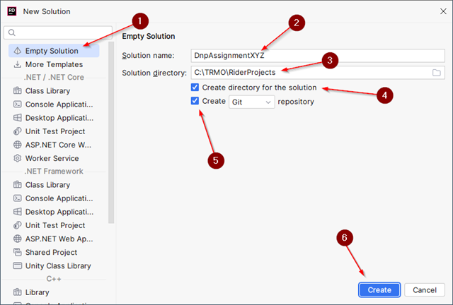
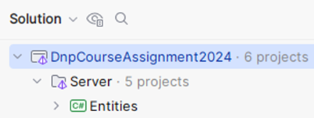
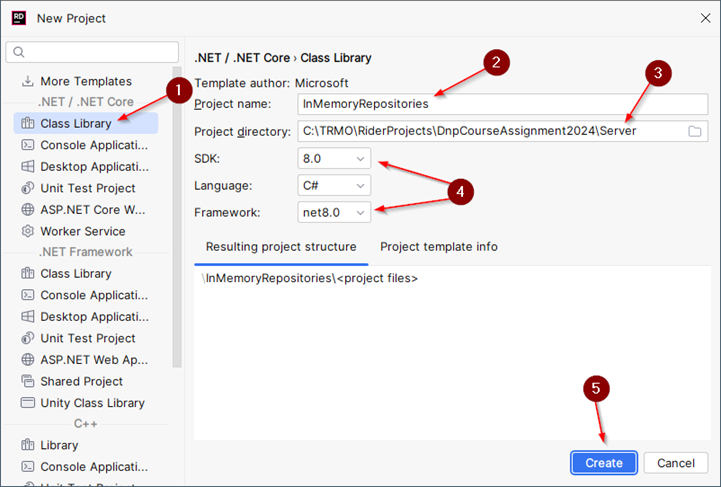
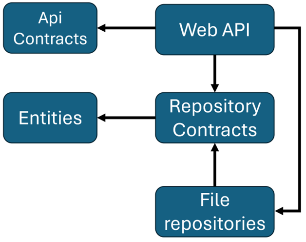
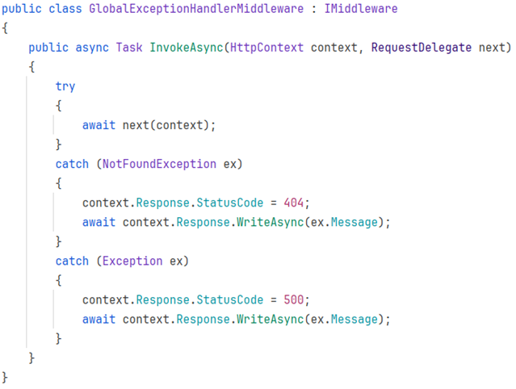

# Table of Contents:

 - [Part 1 - Entities & Repositories](#part-1---entities--repositories)
    - [Step 1.1 - Requirements](#step-11---requirements)
    - [Step 1.2 - Create Solution](#step-12---create-solution)
    - [Step 1.3 - GitHub](#step-13---github)
    - [Step 1.4 - Domain Model](#step-14---domain-model)
    - [Step 1.5 - Entities](#step-15---entities)
    - [Step 1.6 - Implement your entities](#step-16---implement-your-entities)
    - [Step 1.7 - Repositories](#step-17---repositories)
    - [Step 1.8 - Repository Contracts Project](#step-18---repository-contracts-project)
    - [Step 1.9 - In-memory Repository Implementations](#step-19---in-memory-repository-implementations)
    - [Step 1.10 - Formalities](#step-110---formalities)
 - [Part 2 - Command Line Interface (CLI)](#part-2---command-line-interface)
    - [Step 2.1 - Requirements](#step-21---requirements)
    - [Step 2.2 - Status](#step-22---status)
    - [Step 2.3 - Setup](#step-23---setup)
    - [Step 2.4 - Dependencies](#step-24---dependencies)
    - [Step 2.5 - UI Class](#step-25---ui-class)
    - [Step 2.6 - Implement CLI Application](#step-26---implement-cli-application)
    - [Step 2.7 - Business Logic](#step-27---business-logic)
    - [Step 2.8 - Asynchronous Programming](#step-28---asynchronous-programming)
    - [Step 2.9 - Formalities](#step-29---formalities)
 - [Part 3 - File Persistence](#part-3---file-persistence)
    - [Step 3.1 - Status](#step-31---status)
    - [Step 3.2 - Setup](#step-32---setup)
    - [Step 3.3 - File Repository Implementations](#step-33---file-repository-implementations)
    - [Step 3.4 - Update CLI Project](#step-34---update-cli-project)
    - [Step 3.5 - Formalities](#step-35---formalities)
 - [Part 4 - REST Web API](#part-4---creating-a-rest-web-api)
    - [Step 4.1 - Status](#step-41---status)
    - [Step 4.2 - Setup](#step-42---setup)
    - [Step 4.3 - Register Repository Implementations](#step-43---register-repository-implementations)
    - [Step 4.4 - Implement Controllers](#step-44---implement-controllers)
    - [Step 4.5 - GetMany Query Parameters](#step-45---getmany-query-parameters)
    - [Step 4.5 - Global Exception Handler (OPTIONAL)](#step-46---global-exception-handler-optional)
    - [Step 4.5 - Formalities](#step-47---formalities)
 - [Part 5 - Blazor](#part-5---blazor)
    - [Step 5.1 - Status](#step-51---status)
    - [Step 5.2 - Setup](#step-52---setup)
    - [Step 5.3 - User Management](#step-53---user-management)
    - [Step 5.4 - Develop Blazor App](#step-54---develop-blazor-app)
    - [Step 5.5 - Formalities](#step-55---formalities) 
 - [Part 6 - Authentication and Authorization](#part-6---authentication-and-authorization)
    - [Step 6.1 - Status](#step-61---status)
    - [Step 6.2 - Authentication](#step-62---authentication)
    - [Step 6.3 - Authorization](#step-63-authorization)
    - [Step 6.4 - Update your app](#step-64-update-your-app)
    - [Step 6.5 - Formalities](#step-65-formalities)
 - [Part 7 - Some more stuff](#part-7---some-other-stuff)

# Part 1 - Entities & Repositories

In this assignment series you will build out a small forum app. 

For each assignment you will add something new to the project, and at the end of the semester you will have a fully working forum app (hopefully...). 

It will consist of a simple CRUD focused Web API, with Entity Framework Core and a SQLite database to store data. 

For the front-end you will have a Blazor web app.

In this first assignment you will create the entities for your domain model, and you will define repository interfaces (repository is explained later).

Because your app will evolve over time (different parts will be added and swapped out) we need to design the system with modularity in mind. 

We do this by creating multiple *projects*, each responsible for something specific. It will be a simplified layered application.

**The Web API** (i.e. server) will contain two layers; a network layer and a persistence layer. 

Often you will have a business logic layer in between, but we are skipping that, and simplifying the server to focus on the .NET tools rather than good SOLID architecture design. 

You should probably have this extra layer in your semester project.

There is some initial setup, which is best done on one computer, then shared to others through GitHub. 

I recommend reading through the entire document before actually starting on anything.

## Step 1.1 - Requirements
This assignment is open-ended, meaning we provide you with a few minimum requirements, which must be completed. We also have suggestions on how to expand upon the system, should you wish to. Or you can come up with your own ideas.

### Feature description
We need a User, having at least user name, and a password. It needs an Id of type int.
We need a Post. It is written by a User. It contains a Title and a Body. It also needs an Id, of type int.
A User can also write a Comment on a Post. A Comment just contains a Body, and an Id of type int.

All entities must have an Id of type int.
The way we create relationships between the Entities is described in detail further below. In short, we use foreign keys, rather than associations.

### Optional features
Further feature suggestions, if you are brave:
•	A user can like/dislike a post.
•	A user can like/dislike a comment.
•	A user can create a SubForum, meaning a post now belongs to a specific SubForum instead.
•	A user can comment on a comment.
•	A user becomes moderator of a sub forum, they created, meaning they can delete comments and posts.
•	Feel free to add further ideas yourself.

## Step 1.2 - Create Solution
First, you need a new, fresh solution. You may work in groups, so only one group member does the initial setup.
Create a new Solution in Rider:
 


And then:
1)	Select Empty Solution
2)	Give your solution a name
3)	Place it somewhere
4)	Create a new directory, this is probably checked already
5)	Check this to create a git repository. You must have your assignment on GitHub, and hand in a link to your repository. It’s easier if this is checked initially, then you get some extra setup prepared for you, like a git ignore file.
 


Now you should have a new, fresh, empty solution.
## Step 1.3 - GitHub
You must use Git and GitHub for your assignments. You may use whatever branching strategy, you like. Each hand-in on itslearning is typically a link to your main branch. 
A good start is to now commit your *.sln file. E.g.: DnpAssignmentXYZ.sln. This file ”binds” your entire application together.
## Step 1.4 - Domain Model
Based on the above requirements, you must create a domain model diagram, where we can see:
•	The entities of the system
•	The properties (attributes) on the entities
•	The relationships between entities, e.g. Post is written by a User. Remember multiplicities at both ends. Like you were taught for the Entity Relationship Diagram in DBS, or the Domain Model in SWE. 

## Step 1.5 - Entities
It’s time to implement the domain model, i.e. the entities as classes. These will just be data container classes, using properties. 
First, create a new Solution Folder, call it Server. This folder will contain all server related code:
 


Now, your solution looks like this:
 
 

Then, create a new class library to contain your domain entities, inside the Server folder:
 


Then, setup the project as follows:
1)	Select Class Library
2)	Give the project a name
3)	Specify the directory, i.e. put this project into Server
4)	Select SDK and Framework, if available. If you only have one version installed, these are probably greyed out, or not there at all.
5)	Select Create
 


Now your solution looks like this:
 


You can safely delete the Class1.cs file inside Entities. 
Now, you can create your entities, e.g. Post, User, etc, in this project:
 
 

Remember, all your classes should be under git version control. But you must also tell git about your projects.
This is done by adding and committing the *.csproj file for each project.
Initially, a new project will have its name in red font, meaning git does not know about it. E.g.:
 


You must then find the *.csproj file and add it. First, change the view from ”Solution” to ”File system”:
 


Then add the .csproj file in the project to git:
 
 

Do this for your Entities library project.

### Entity Relationships Modelling
You are used to model relationships with associations, e.g. a Post has many Comments. Then the Post would have a List of Comments.
We don’t initially do this. It comes later in the course.

> [!IMPORTANT]
> DON’T DO ASSOCIATIONS NOW

We use the approach of a relational database, and model our entity-relationships using foreign keys.
This means a Comment will have a property called PostId, which references the post, that the comment belongs to.
A Post might have a SubForumId, which references the Sub Forum it belongs to. If you make this feature.
A Post will also have a UserId property, referencing the User, which wrote the post. Similar for the Comment. And so on.
Here is what your Post might initially look like. We use auto-properties instead of field variables! This is important!
 
```csharp
public class Post
{
    public int Id { get; set; }
    public string Title { get; set; }
    public string Body { get; set; }
    public int UserId { get; set; }
}
```

You may add constructor(s) if you find this needed. It will be later, and it will then be explained how to do it. Or you can just use the object initializer approach.

## Step 1.6 - Implement your Entities
Implement all your entities now.


## Step 1.7 - Repositories
Repository pattern is similar to Data Access Pattern, if you are familiar with that. 
A Repository is an abstraction of data-access for a single entity. This means a Repository is an interface, and the implementation manages how to persist a specific entity-type, somehow. We will initially use a List (i.e. no actual persistence), then a file, and then a database, as we progress through the course.
The Repository interface comes in different shapes, but it will generally provide some standard methods, usually like Create, Read, Update, Delete (i.e. CRUD for short), though maybe renamed.
The Command Line Interface (assignment 2) and Web API (assignment 4) will use a Repository to save incoming data, or extract requested data, etc.
Both the ”presentation/network” layer, and the persistence layer will change over time, but the Repository-interfaces remain the same. This means they must live in their own respective project. It becomes similar to the layered architecture you have seen on second semester, and each project becomes a layer. Sort of.

## Step 1.8 - Repository Contracts Project
The Repositories live on the server side, and is only used on the server side.
We need a project to house the Repository interfaces, aka ”contracts”. The actual implementations will go elsewhere, later.
Create a new Class Library Project, first:
 


And then setup the project:
1)	Select type
2)	Input project name
3)	Update the path, so the project is located in a ”Server” folder.
4)	Select versions
5)	Select to create


 
And finally the new solution structure:
 


You can, again, delete Class1.cs. And put the RepositoryContracts.csproj file under version control, like before with the Entities project.

### Add Reference
The new RepositoryContracts project need to work with your entities. These are located in a separate project, and so we need to add a reference from RepositoryContracts to Entities.
Right click on the ”Dependencies” inside RepositoryContracts.
 


And then select the project, you want to referece, in our case the Entities:
 


Finally, select [Add].
Note: In the image above, it says <Shared>. In yours it says <Server>.

### Create Repository Interfaces
In this project you put Repository interfaces. One for each entity. And you will have at least 3 entities: Post, User, Comment. Maybe more, if you decide to expand your application with more features.
Our repository interfaces will define 5 standard methods:
1)	Add – Used to store a new post
2)	Update – Used to update an existing.
3)	Delete – Delete an existing post.
4)	GetSingle – Get a single post.
5)	GetMany – Get multiple posts.

Here is an example for the IPostRepository interface. The others look almost identical:

```csharp
public interface IPostRepository
{
    Task<Post> AddAsync(Post post);
    Task UpdateAsync(Post post);
    Task DeleteAsync(int id);
    Task<Post> GetSingleAsync(int id);
    IQueryable<Post> GetMany();
}
```

For now, ignore the Task return types, and the ”Async” method name suffixes. This will be explained later.
Method descriptions:

**Add** takes a Post, and returns the created Post. This is because the server sets some data on the Post, e.g. the ID, and this should be returned to the client. The client might need this ID for something. This is common.

**Update** takes a Post (with ID), and just replaces the existing Post. If no existing Post is found, an exception is thrown to indicate the error.

**Delete** will remove the Post with a given ID. If no matching Post is found, an exception is thrown.

**GetSingle** will return the Post matching the given ID. If no Post is found, an exception is thrown.

**GetMany** will return an IQueryable. This is an interface which can looped over in a for-each loop to extract the relevant entities. Or we can use LINQ, which we will see later in the course. 
This makes filtering the Posts by some criteria easier (using predicates, later). 
Maybe we want to fetch all Posts with a specific sub-string in the postname. Or some other property on the Post.
The method is not async, the reason of which we will get back to, when we add a database.

> [!IMPORTANT]
> You will define such an I*Repository interface per entity!

### What is Task and Async?
We will come back to this in session 2. It is asynchronous programming. It’s an optimization approach, so that different tasks/jobs/pieces of code can automatically be executed in parallel. Sort of like automatic multithreading. It is just managed for us, instead of us having to explicitly create threads.
It requires us to return a Task, sometimes wrapping the actual value, e.g. Task<User>. This is a Task which will eventually return a User. We can then extract the User from the Task, when the Task is finished.
By convention asynchronous methods have their method names suffixed with ”Async”, to indicate they are used differently from normal methods.
Again, we will come back to this later.	

## Step 1.9 - In-memory Repository Implementations
We will create initial implementations for the repository interfaces. We start by just keeping the data in a list, i.e. nothing is actually saved to disk or database, this comes later. But it let’s us create a ”complete” system by assignment 2, which we can actually play around with.

### New project
Again, we need a new project. We are going to use his approach a lot, creating new projects to organize our code by technical responsibility.
The project goes into the Server package, it is a class library, and is named InMemoryRepositories.
Create a new class library like this, by right-clicking on the Server folder:
 


And then:
1)	Select Class Library
2)	Choose project name. Meaningful names are important.
3)	Make sure it goes into the Server folder
4)	Pick versions, if possible.
5)	Select Create.


 
Delete Class1.cs.
Put the project under version control, as previously.

### Dependency
You need to add a dependency from InMemoryRepositories project to the Entities project, as you have done before.
This is so your repository implementations can know about the entities they manage.
You will also need a dependency from InMemoryRepositories project to the RepositoryContracts project, because this is where the interfaces are located:
 


Now your solution structure looks like this:


 

### Implementations
You will inside your new project create an implementation per repository interface.
The repository implementation just uses a list to store entities in.
Below is a description of the PostInMemoryRepository, step by step. You will then repeat the process for the other repository implementations. You could easily divide the work amongst group members here.

#### Post Repository class
First, you need a class, which implements the IPostRepository:


 
Notice the location of the class, and the class definition in the file.

#### List to contain the entities
You must add a field variable of type List<Post>. I have called it ”posts”, you can call it whatever makes sense to you. This will contain our entities.

#### Add method
This is the AddAsync method:

```csharp
public Task<Post> AddAsync(Post post)
{
    post.Id = posts.Any() 
        ? posts.Max(p => p.Id) + 1
        : 1;
    posts.Add(post);
    return Task.FromResult(post);
}
```

It takes a Post as parameter, and returns a Post (inside a Task).
We first set the Id of the post. This is done by finding the current maximum Id of all the posts, and incrementing that value. Better and cleverer approaches exist, but we will eventually use a database to generate the Id. I use a [ternary operator](https://learn.microsoft.com/en-us/dotnet/csharp/language-reference/operators/conditional-operator) to check if there are any posts in the list, and if so, use the current maximum Id plus 1. Otherwise just use Id 1. It’s a short-hand if-else.
The Post is added to the list, i.e. the field variable you just created.
This method is not doing anything asynchronous. This will come later. So, to return a Task containing a Post, we have to explicitly wrap our post into a Task. That happens in the last line.
#### Update method
This is the update method:

```csharp
public Task UpdateAsync(Post post)
{
    Post? existingPost = posts.SingleOrDefault(p => p.Id == post.Id);
    if (existingPost is null)
    {
        throw new InvalidOperationException(
                $"Post with ID '{post.Id}' not found");
    }

    posts.Remove(existingPost);
    posts.Add(post);

    return Task.CompletedTask;
}
```

It receives a post, and returns nothing, i.e. a Task not containing an object.
First, we look for an existing post with the Id of the incoming argument-post. The SingleOrDefault method will loop through the posts-list, and find a post, which matches the predicate.
If none is found, null is returned. As indicated by the variable type of ”Post?”. I.e. the question mark indicates the variable ”existingPost” may be null.
We check if the existingPost is null, in which case there is nothing to update, and an exception is thrown. This exception can then be handled elsewhere, and an error can be returned to the client.
Alternatively, you could create a new Post. That’s up to you, if you want that.
The easiest way to overwrite an existing post is just to delete the existing, and insert a new, with the same Id. So that is what we do.
In the end, we have to return a Task, but it does not contain anything, so we just return a ”completed task”.
Delete method
Here is the delete method:

```csharp
public Task DeleteAsync(int id)
{
    Post? postToRemove = posts.SingleOrDefault(p => p.Id == id);
    if (postToRemove is null)
    {
        throw new InvalidOperationException(
                        $"Post with ID '{id}' not found");
    }

    posts.Remove(postToRemove);
    return Task.CompletedTask;
}
```

This time we just need an Id to remove a Post, so that is the parameter.
Again, we look for an existing post. If none is found, we throw an exception.
Then the found post is removed from the list.
And a completed task is returned at the end.
GetSingle
Here is part of the method to return a single entity by Id:

```csharp
public Task<Post> GetSingleAsync(int id)
{
    // Do implementation
    return Task.FromResult(post);
}
```

This time, you do the implementation yourself. It is very similar to the Delete method. You must look for a post. If none exist, throw an exception.
At the end the post is returned, wrapped in a Task.
GetMany
Finally, we need to be able to get many Posts, and apply some filtering, or ordering:

```csharp
public IQueryable<Post> GetManyAsync()
{
    return posts.AsQueryable();
}
```

A list, or most types of collections, can be converted to an IQueryable. This is an interface, which just provides the option to loop through it, e.g. with a for-each loop. Or LINQ, which we will get back to.
So, we convert the list of posts to an IQueryable<Post>.

### Other repositories
You must now implement your other repositories. They will look very similar! 
You might even consider some optimization, so you don’t have so much duplicate code. If you are brave.

### Optional: Initial dummy data
Each of your repositories could create some initial dummy data, just so you have a few posts, users, comments, etc, when the application starts. Next time it will be easier to test things, when you have this initial data.
You can e.g. create this data in each of the constructors. You may benefit from having a specific method for this, which the constructor could call.

## Step 1.10 - Formalities
 - You may work on this assignment in groups.
 - You must have your assignment on github.
 - You will hand in a link to your GitHub repository on itslearning.

Deadline can be found on itslearning.

# Part 2 - Command Line Interface (CLI)
In this assignment, you will expand your application with a Command Line Interface (aka CLI). This is a simple text-based interface in your console/terminal. You read commands from the terminal and you output data to the terminal.

You will create some kind of functioning user interface to support the requirements specified last time.

## Step 2.1 - Requirements:

- Create new user (user name, password, etc.)
- Create new post (title, body, user id)
- Add comment to existing post (body, user id, post id)
- View posts overview (just display `[title, id]` for each post)
- View specific post (see title, body, and comments on the post)

You have some freedom in how you structure the output and how you read the input. You are of course welcome to add more functionality to your CLI application:

### Manage users:

- Create new.
- Update existing.
- Delete user.
- See all users.

### Manage posts:

- Create new.
- Update existing.
- Delete post.
- See overview of posts, e.g., just id and title.
- View single post.

**”CRUD”** operations on the other entities.

When viewing a list of some entity, consider adding filtering options:

- See all posts by a specific user id.
- See all comments a specific user has made.
- See all users with some specific word in their username.

See the previous assignment for other examples.

## Step 2.2 - Status

Last time you implemented the domain model repository interfaces and some simple in-memory repository implementations which just used a list to keep track of the entities. Your application (hopefully) looks like this:


Or as a component diagram, we can show it like this (each box is a project):


The arrows indicate dependencies between projects. The repository interfaces in the `RepositoryContracts` project manage the entities, and your repository implementations implement the repository interfaces.

## Step 2.3 - Setup

First, we need a new project for the Command Line Interface.

### Create a Console Application project on the Server side:

- Select **Console Application**. This will be a runnable project, i.e., it has a main method (though implicit), so we can actually start the application.
- Give the project a name.
- Make sure the project is located in the Server folder.
- Pick SDK if possible.
- The language is obviously C#.
- Use the latest framework.
- We don’t need Docker.
- Create the project.


You then get this. There’s the CLI project with a `Program.cs` class, which has an "implicit" main-method. I.e., there is no method at all. You should just think of the method signature as invisible, and the file contains the actual method body.


You can run this main method by right-clicking on the CLI project:


Give it a go and verify "Hello World!" is printed to the console.

## Step 2.4 - Dependencies

Your new CLI project needs to have dependencies on:

- `Entities`
- `RepositoryContracts`
- `InMemoryRepositories`

1. Right-click and select "reference"


2. Select projects to reference.
3. Click add.


Now the component diagram looks like this:


Dependencies are transient. 
For example, in the above, we have the following dependencies:

    RepositoryContracts -> Entities
    CLI -> RepositoryContracts

Which also means:
	
    CLI -> Entities


## Step 2.5 - UI Class
We probably don’t want all the UI logic in the `Program` file. The `Program` file is just used to create an instance of your UI class and pass in repository instances, and then “start” the UI.

So create a new directory, call it e.g., "UI." And inside this directory, create the class which will manage your CLI UI. Something like this:


### `Program.cs`

This class is now supposed to just create the necessary classes and start the UI. It could look something like this:


The main point is:

- `Program.cs` initially instantiates whatever needs to be created, probably primarily repositories.
- They are passed to the `CliApp`.
- Then the `CliApp` is started. This call is `await`ed. When you start using asynchronous programming, your entire app is quickly infiltrated with "Async" and `Tasks`. In the app, eventually, an async method on a repository is called, and async methods can only be called by other async methods. "It’s turtles all the way down," as they say.

You may rework this structure as you see fit. I strongly recommend splitting your UI logic into separate classes, and then you could potentially instead pass the repositories to the specific classes. This will make parallel team-work easier too.

You could consider which "views" are necessary and create a class responsible for a specific view.

The overall organization of your classes is left to you. Here is my initial attempt, which can currently just create a new user and view a list of users:


The `CliApp` may create a new `ManageUserView` instance. This is then responsible for instantiating `CreateUserView` and `ListUsersView` when needed.

## Step 2.6 - Implement CLI Application

You must implement the CLI application so that it fulfills the stated minimum requirements. You must print to the console and read from the console as needed.

### Dependency Injection

You **MUST** only instantiate the repositories in the `Program.cs` class! This is the only place where you have `IPostRepository postRepo = new InMemoryRepository();`.

You then pass this variable `postRepo` around as needed through the constructors of other UI classes. If you have a class to handle the creation of a new post, this class should receive an `IPostRepository` as an argument in its constructor.

Otherwise, your classes might use different repository instances, meaning if you create a post and later want to view it, this may not be possible. If all UI classes share the same instance, it will be the same list of entities you have access to.

It will also be easier in Assignment 3 to swap out the repository implementations.

This is my `Program.cs` file; notice the instantiation of repositories:


And this, for example, is part of my UI class handling the creation of posts:


The repository is injected through the constructor. Notice the field variable type is the interface, not the concrete implementation. With this approach, future updates to your application will be much simpler. This is the Dependency Inversion Principle from SOLID in action.

Next assignment, you will implement new versions of your repositories, and you will (hopefully) only have to update the `Program.cs` class of your CLI app in order to swap out implementations. If you have done it correctly.

## Step 2.7 - Business Logic

Consider implementing some minimal business logic:

- Is the user input correct?
- If adding a comment to a post by a user, do both post and user IDs actually exist?
- When creating a user, is the username already taken?
- Etc.

## Step 2.8 - Asynchronous Programming

As mentioned previously, once you start using asynchronous programming, most of your methods quickly become asynchronous, all the way up to the main method.

The general approach is whenever you call an asynchronous method, the calling method will `await` the call. Here’s an example. We are adding a user to the `IUserRepository`; this is a call to an asynchronous method:

```csharp
private async Task AddUserAsync(string name, string password)
{
    // ...
    User created = await userRepository.AddAsync(user);
    // ...
}
```

We can identify the asynchronous method by the suffixed ”Async”. Or that it returns a Task:


We put `await` in front of the call. This will ”pause” the code execution here, until the Task is finished, and then extract the contained object within the Task. In this case the User.
In my case, I print out the generated Id of the new User (this part is not shown here).
When we want to use the await keyword, we must make the containing method async too, and make it return Task instead of void, or return a Task<Something> instead of returning just Something.
So, my AddUserAsync method is marked as async, returning a Task.
This escalates upward, so the method calling AddUserAsync must also await the method call, and that method must itself be async. And so on. All the way out to the main method. Turtles all the way down. Or up. Depending on where you view it from.

### Initial dummy data
Each of your repositories must create some initial dummy data, say 3-5 entities, just so you have a few posts, users, comments, etc, when the application starts. It will be easier to test things, when you have this initial data.

## Step 2.9 - Formalities
 - You may work on this assignment in groups.
 - You must have your assignment on github.

Deadline can be found on itslearning.

# Part 3 - File Persistence

In this assignment, you will expand your app to save data in files. This way, data is saved even when the app is restarted. The content of the files will be in JSON format.

## Step 3.1 - Status

Last time, you implemented a command line user interface.  
Your application should look something like this:


Or as a component diagram, we can show it like this:


The arrows indicate dependencies between projects.  
We will expand with a new project to contain new implementations for the repository interfaces, this time using files to store data so that the data is actually persisted between sessions of the application running.

## Step 3.2 - Setup

Again, we need a new project, this time for the new improved better repository implementations.

- Create a Class Library project on the Server side.


And then:

1. Select **Class Library**.
2. Give the project a meaningful name.
3. Make sure the project is located in **Server**.
4. Pick SDK language framework if possible.
5. And create the project.


As usual, delete the `Class1.cs`.  
And do git version control.

### Dependencies

Your new FileRepository project needs to have dependencies on:

- `RepositoryContracts`
- `Entities` (though this automatically happens through `RepositoryContracts` as it is a transitive dependency)

Your CLI needs a dependency on your `FileRepositories`.

Now your component diagram looks like this:


The red X indicates this dependency is no longer needed after the completion of this assignment.

## Step 3.3 - File Repository Implementations

Inside your new project, you must create an implementation for each of the repository interfaces.  
You will not have a private field variable of some list containing entities. Instead, this “list” is represented by the file.

Each method must then, as needed, do:

1. Read the text (JSON) from the file.
2. Deserialize JSON-text into a list.
3. Interact with this list, e.g.:
   - Add new entity.
   - Retrieve entity.
   - Delete entity.
   - Overwrite entity.
4. Serialize the list to JSON.
5. Write the JSON back to the file, overwriting the existing content.

You should use the async file interaction methods: `ReadAllTextAsync`, `WriteAllTextAsync`, etc.

### Example of AddAsync Method

I provide below an example of the `AddAsync` method. The others are similar in the way they use JSON and the file to get a list, and the list is then used similar to the InMemory versions:

```csharp
public class CommentFileRepository : ICommentRepository
{
    private readonly string filePath = "comments.json";
        
    public CommentFileRepository()
    {
        if (!File.Exists(filePath))
        {
            File.WriteAllText(filePath, "[]");
        }
    }
    
    public async Task<Comment> AddAsync(Comment comment)
    {
        string commentsAsJson = await File.ReadAllTextAsync(filePath);
        List<Comment> comments = JsonSerializer.Deserialize<List<Comment>>(commentsAsJson)!;
        int maxId = comments.Count > 0 ? comments.Max(c => c.Id) : 1;
        comment.Id = maxId + 1;
        comments.Add(comment);
        commentsAsJson = JsonSerializer.Serialize(comments);
        await File.WriteAllTextAsync(filePath, commentsAsJson);
        return comment;
    }
}
```

### Explanations:
- **Line 3**: Here we define the file path. We create a file per entity.
- **Line 5-10**: The constructor ensures there actually is a file. If none exists (e.g., the first time the program is run), a new file is created with the content of an empty list, i.e., no entities. The `"[]"` is an empty collection in JSON.
- **Line 13**: This is the method header, asynchronous, returning a `Task` containing the “finalized” comment, i.e., it now has an ID.
- **Line 15**: We read all the content from the file; this is, of course, in JSON format.
- **Line 16**: The JSON is deserialized into a list of comments.
- **Line 17**: We calculate the next ID to use.
- **Line 18**: Set the ID.
- **Line 19**: Add the comment to the list.
- **Line 20**: Serialize the list to JSON.
- **Line 21**: Write the JSON back to the file.
- **Line 22**: Return the finalized comment now that it has an ID.


**Hint**: I have afterward extracted the loading and saving to helper methods to minimize code duplication.

### GetMany Detail

Sometimes you may not be able to await a `Task`. Instead, you can call `Result` on a task as in the first statement at the end:

```csharp
public IQueryable<Comment> GetMany() {
    string commentsAsJson = File.ReadAllTextAsync(filePath).Result;
    List<Comment> comments = JsonSerializer.Deserialize<List<Comment>>(commentsAsJson)!;
    return comments.AsQueryable();
}
```

`ReadAllTextAsync()` returns a `Task` containing a string. Calling `Result` instead of awaiting will extract the string. This is generally not advisable because we lose the async behavior and optimization, but in this case, the method header is not async as defined in the interface, so we have to “cheat.”  
Again, the lack of async on this method is made clearer when we get to the database part.

## Step 3.4 - Update CLI Project

Your CLI project must now use the new repositories instead of the InMemory versions.

1. **Add Reference to FileRepositories**  
   Add a reference from the CLI project to the FileRepositories project so your CLI app can use the new repositories (if you didn’t do this above).

2. **Remove Reference to InMemoryRepositories**  
   The easiest approach to make sure you update all references to the InMemory repositories is to delete the dependency reference from the CLI project to InMemoryRepository.

   - You do this by editing the `CLI.csproj` file.
   - Go to File System view:


   - Find the `CLI.csproj` file:


   - Delete the reference to the InMemoryProject.


   - Go back to the solution view.
   - Watch your CLI project fail to compile now. All errors are where you are referencing a repository implementation, not the interface; those live in a different project, the RepositoryContracts.

### Update Repository Implementation References

Each place where you reference an implementation, e.g., `PostInMemoryRepository`, you must change the class to `PostFileRepository`. Hopefully, you only need to modify about three lines of code in the `CLI/Program.cs` class. Notice I instantiate file repositories here instead:


## Step 3.5 - Formalities
 - You may work on this assignment in groups.
 - You must have your assignment on GitHub.

Deadline can be found on itslearning.

# Part 4 - Creating a REST Web API
In this assignment you will expand your app with a Web API. Now, external clients like other applications or web sites can access your program to manipulate and retrieve forum data.

## Step 4.1 - Status
Last time you implemented a new component in the persistence layer, which was working with files. This had the effect of actually storing data between sessions of your program running.

Your application should look something like this:


Or as a *component diagram*, we can show it like this:


The arrows indicate dependencies between projects.

At this point, you should be able to safely delete the InMemoryRepository project, as it is no longer used. You may also choose to keep it, that’s up to you.

Did you notice how easy it was to swap out which repository implementation to use in the Program.cs class? Assuming you did set things up correctly.

We will expand with a new project, to contain the Web API, upgrading the system to a server, which various clients can connect to.

Illustrating with a component diagram, your system will look like this:


## Step 4.2 - Setup
We need two things: the Web API itself, and the objects sent back and forth. They go in two different projects.

### DTO's
Sometimes it is valid to use the actual entity classes, which you already have, to transport data between client and server. But quite often, they are not designed for this purpose, and it can become cumbersome.

We therefore usually create dedicated Data Transfer Objects, which are just simple classes dedicated to transport data. These classes become part of the public API of your server.

For these, we need a new project, which is going to be shared between server and client.

First, create a new solution folder, call it Shared:


And then like this:


In this Shared folder, you create a new class library:

1)	Select class library
2)	Give the project a name. E.g. ApiContracts, or DTOs, or whatever you feel makes sense.
3)	Put it into Shared folder.
4)	The usual
5)	Create project


Delete the `Class1.cs`

Put the `ApiContracts.csproj` under  version control.

**Note:** In your SEP3, if you use a 3-tier system, you might want to send your entities between logic and data tier, e.g. 2, and 3.

Between the user-facing-client and the server, you are often better off using specialized DTOs. In this system we will have a client and a server, so we’re going with DTOs.

### Web API

And again, we need a new project.

Create a Web API project, on the Server side.


And then:

1)	Select WEB. This is where we find everything related to web development.
2)	Give the project a meaningful name.
3)	Make sure the project is located in Server.
4)	Pick SDK, language, framework, if possible.
5)	Select the Web API Template. This part is important! You have many choices for what kind of template project you want. If pick the wrong, it may look almost correct, but be completely wrong. Pay attention here.
6)	No authentication, and no Docker. Thes eshould be ”off” by default, but just make sure.
7)  Check the "UseControllers" box - this will allow us to start with a Controller based template.
8)	Finally, create the project.


This time you get a few more files. Put them under version control:


And remember the `.csproj` file too. Either by going to File System view. Or just select the git panel to see unversioned files:


### Dependencies
Your new Web API needs access to several projects, so, add dependencies from Web API to::

 - RepositoryContracts
 - Entities
 - FileRepositories
 - ApiContracts (or DTOs, or..)

 We no longer use the CLI or InMemoryRepositories, so, no dependencies to those.

 

 Here is now the updated component diagram (with unused components removed):

 

 ## Step 4.3 - Register Repository Implementations
 for the Web API we are going to use Dependency Injection. This means, we must register all ”services”, which a Web API controller can request. In our case that will be the repositories.

 In the `Program.cs` file, you must add your services:

 

 If you have other repositories, like `SubForumRepository` or `LikeRepository`, they too should be added.

 Now, a Controller can request any of the I*Repository interfaces, as needed, and the Dependency Injection functionality will handle creation for us. This is very convenient. 

 Similar to the CLI project, the creation of specific implementations is isolated to a single place, so when we later need to swap out the repository implementations again, it will be very easy. We just modify these three lines of code.

 ## Step 4.4 - Implement Controllers
Finally, the task has come to implement the controllers.

Create a controller for each entity in your system! PostsController, UsersController, CommentsController, etc.

Create an endpoint for each standard method, per entity:
 - Create
 - Update
 - GetSingle
 - GetMany (consider which search parameters might be relevant)
 - Delete

 Use correct HTTP action verbs.

 Follow REST convention for routing.

Consider which entities belong to other entities. Define routes accordingly, e.g. “localhost:port/orders/{id}/orderlines”. 

These endpoints can be placed in the parent (Orders) controller. Other endpoints for the child entity (orderlines) can go into the ChildController. The design choice is yours.

Any DTOs you need will be placed in the ApiContracts project, so that your client eventually can also use these.

**Considerations:**
It is up to you to decide what the return data (DTO or Entity?) should look like. When you request a Post, do you just get the Post? Or do you get all comments too? Maybe include a parameter to indicate, whether you want the comments included.

If you wish to display a Post, you may need username of the author as well.

## Step 4.5 - GetMany query parameters
For the GetMany users endpoint, it must be possible to filter the users by whether the user name contains a certain string. You may add more filter criteria.

For the GetMany posts endpoint, it must be possible to filter by:

 - Title contains a certain string
 - Post is written by a certain user (id and/or name)
 - You may add more filter criteria, e.g. get the top 10 most liked posts or...

 For the GetMany comments endpoint, it must be possible to filter by:

 - user id and/or name. 
 - Post id.
 - You may add more filter criteria.

For other GetMany endpoints, you decide which query parameters make sense.

### Comment about business logic
We have made a two-layered system: Web API layer and persistence layer. Usually, you will have a layer in between for business logic, validation, rules, etc. We have neglected that, as architecture design is not a focus for this project.

Should you wish to implement business logic, you can do this directly in the controller methods.

For example, when creating a new Post, it references a user. You could first verify, that the user exists.

Or when creating a new User, you could check if the username is already in use.

If you are bold, you would add a new library project specifically for business logic classes, and achieve a 3-layered architecture. This is out of scope of the requirements for this project.

Often you would have a PostsService, and UsersService, etc, with appropriate methods, which then calls relevant repositories.

### User Controller implementation example
To get you started, here’s the initial code for my UserController:


 - `[ApiController]` marks this class as a controller, which must be picked by the application when it startes. That’s the ”builder.Services.AddControllers()” call we did above.
 - `[Route("[controller]")]` says the route to this controller will be: ”localhost:port/Users”, because the class starts with Users(Controller)
 - The class extends ControllerBase, which gives access to helper methods, and other stuff.
 - The class receives a repository through the constructor, which each endpoint can use to manipulate.

### Create endpoint
The following is my create user endpoint:

```csharp
[HttpPost]
public async Task<ActionResult<UserDto>> AddUser([FromBody] CreateUserDto request)
{
    await VerifyUserNameIsAvailableAsync(request.UserName);

    User user = new(request.UserName, request.Password);
    User created = await userRepo.AddAsync(user);
    UserDto dto = new()
    {
        Id = created.Id,
        UserName = created.UserName
    }
    return Created($"/Users/{dto.Id}", created); 
}
```

We mark the method `[HttpPost]`, so a POST request to ”localhost:port/users” will hit this method.

The method is async, and returns an ActionResult containing a UserDto object. We generally don’t want to expose our domain entities to the clients, for example in this case, the User entity contains a password. So I create a UserDto containing only Id and UserName, and put it in the ApiContracts project.

The ActionResult is an “http message”, it contains all kinds of potentially useful meta information, along with the User object as JSON.

The [FromBody] tells the Web API where to find the data for this parameter, in the body of the HTTP request message sent from the client. This attribute is not always strictly necessary, as the Web API is decent at figuring out the parameters by itself. But I like to be explicit.

Line 4 verifies the username is available. I have a private helper method for this. It just tries to find an existing user with the given username.

Line 6 creates a new User entity from the CreateUserDto object.

Line 7 uses the repository to create the user. The ”finalized” user is returned (the ‘created’ variable), now this variable has an ID.

Line 8 returns the newly created User, and tells the client which route will return it.

Exceptions might be thrown from lower layers, e.g. persistence, so those can be caught here. Though, in my case I have gone with the optional exercise below, and made one class to handle all exceptions.

If you want to handle exceptions here instead, you wrap the entire method body in a try-catch, and catch Exception, e.g.:

```csharp
[HttpPost]
public async Task<ActionResult<User>> AddUser([FromBody] CreateUserDto request)
{
    try
    {
        await VerifyUserNameIsAvailableAsync(request.UserName);

        User user = new(request.UserName, request.Password);
        ...
    }
    catch (Exception e)
    {
        Console.WriteLine(e);
        return StatusCode(500, e.Message);
    }
}
```

We just return a 500-server error, with the exception message. You could differentiate your exceptions, i.e. have multiple catch clauses, and return more specific error codes. 

If it is validation logic, which fails, perhaps it is a 400-BadRequest error code, instead of 500-ServerError.

If an entity is not found, return 404-NotFound error code. I have a NotFoundException, which is thrown from the repository in these cases.

Here is the CreateUserDto class. It contains the specific information the client needs to fill out, in order to create a User. I.e. there is no UserId property, because the server is responsible for this:

```csharp
public class CreateUserDto
{
    public required string UserName { get; set; }
    public required string Password { get; set; }
}
```

I use the `required` keyword to indicate that when creating a CreateUserDto these properties must be set. Otherwise the compiler will complain.

## Step 4.6 - Global Exception handler (OPTIONAL)
Tired of try-catch in all your endpoints? You can make a global exception handler, i.e. one place, which will handle all exceptions.

Have a look here: [Handle errors in ASP.NET Core web APIs | Microsoft Learn](https://learn.microsoft.com/en-us/aspnet/core/web-api/handle-errors?view=aspnetcore-8.0)

Alternatively you can use a Middleware filter, like this: [Error Handling in .NET Core Web API with Custom Middleware (c-sharpcorner.com)](https://www.c-sharpcorner.com/article/error-handling-in-net-core-web-api-with-custom-middleware/)

This could be a starting point for the implementation:



I have here my own custom `NotFoundException`, which is thrown from the repository implementation, if no entity with a given ID was found.

My own approach is to create a class which implements the IMiddleware interface, as described in the second link, I believe.

## Step 4.7 - Formalities
 - You may work on this assignment in groups.
 - You must have your assignment on github.

Deadline can be found on itslearning.

# Part 5 - Blazor
In this assignment you will expand your app with a client front end, built using Blazor. This is the user facing UI of your app.

## Step 5.1 - Status
Last time you implemented a Web API. This had the effect of exposing your system to the internet.

Your application should look something like this:


Or as a *component diagram*, we can show it like below. 

I have removed unused projects (CLI, and Inmemory repositories):


The arrows indicate dependencies between projects. 

We will expand the application with a new project, to contain the Blazor front-end, upgrading the system to a client-server arhictecture.

## Step 5.2 - Setup
As always there is a bit of setting up, before you can get started on the code. This involves creating a Blazor project.

### Client solution folder
First, we need to create a new solution folder, to house the client code. 


And then:


Resulting in this solution structure:


### Blazor project
Next up, you need to create a new project with the Blazor template, in the Client folder:


And then select and setup the project template:

1)	This is found in the ASP.NET Core Web Application template section.
2)	Give the project a name.
3)	Select the directory, notice I put it in “Client”, to match the solution structure shown in Rider.
4)	Select “Blazor Web App” as the template type. An alternative is “Blazor WebAssembly Standalone App”, this is also doable, but in my experience the former is easier to work with. It makes little difference.
5)	No authentication, we will apply our own later on.
6)	Create the project.


### Add project reference
Your Web API receives DTOs, and these are sent from the Blazor app. This means that the Blazor project should reference your ApiContracts project in the Shared solution folder.

### Set default render mode
Remember to set the default render mode, so that your pages are not static.

Open the App.razor file, and add:


## Step 5.3 - User management
Most of your entities are probably connected to a user, e.g. a post is written by a user, or a comment is written by a user.

This might mean, your web api checks for an existing user, when you add a new post or comment.

This assignment will not deal with user management, so when you create a post or comment, or something else connected to a user, you might just hardcode the id foreign key reference to 1, and make sure you have a user with that id.

This obviously means all posts, comments, etc, will be written by the same user.

In the next assignment we will add a login system, so you can distinguish between users, and who is logged in. In that case, you can update your code, so when a post, comment, whatever is created in Blazor, you can check who is logged in, get their ID, and then assign the correct ID to the post, comment, whatever.

## Step 5.4 - Develop Blazor App
Now it’s time to develop the actual app.

You don’t get a lot of help this time around, I instead expect you to rely on the online documentation linked to in itslearning. Do note that this documentation probably uses the WebAssembly approach, though almost everything else should be the same. I strongly recommend you use a Blazor Server approach, as it it easier to work with, and debug.

### Http structure
You Blazor app will, somehow, use the HttpClient class to contact the Web API (as taught in a previous session). To keep some separation of concern, you will put your HttpServices in a separate folder:


And for each service, you will create an interface. For example:

```csharp
public interface IUserService
{
    public Task<UserDto> AddUserAsync(CreateUserDto request);
    public Task UpdateUserAsync(int id, UpdateUserDto request);
    // ... more methods
}
```

This interface will have an implementation, which uses the HttpClient to contact the Web API.


With some initial code:

```csharp
public class HttpUserService : IUserService
{
    private readonly HttpClient client;

    public HttpUserService(HttpClient client)
    {
        this.client = client;
    }

    public Task<UserDto> AddUserAsync(CreateUserDto request)
    {
        // todo...
    }

    public Task UpdateUserAsync(int id, UpdateUserDto request)
    {
        // todo...
    }
    
    // more methods...
}
```

Notice the HttpClient is injected through the constructor. This happens automatically when we use the dependency injection functionality.

### Add HttpClient for dependency injection
Blazor supports dependency injection, similar to the Web API. So, we need to register services (our own, e.g. UserService, PostService, etc), and also an HttpClient.

The HttpClient is registered in the BlazorApp/Program.cs file like this:


The BaseAddress property must point to your Web API, so the port, 7005, is probably different in your app. When you run the Web API, the address is printed to the console. Notice it is the https value.

### HTTP service implementation example
Most of the methods in the services are pretty similar:

 - You want to send something to the server
 - You want to handle the response, whether success or failure

And so, the code gets repetitive. I provide here an example for the AddUserAsync method:

```csharp
public async Task<UserDto> AddUserAsync(CreateUserDto request)
{
    HttpResponseMessage httpResponse = await client.PostAsJsonAsync("users", request);
    string response = await httpResponse.Content.ReadAsStringAsync();
    if (!httpResponse.IsSuccessStatusCode)
    {
        throw new Exception(response);
    }
    return JsonSerializer.Deserialize<UserDto>(response, new JsonSerializerOptions
    {
        PropertyNameCaseInsensitive = true
    })!;
}
```

We use the PostAsJsonAsync method on the client. This simplifies the process, because we would otherwise have to manually serialize the CreateUserDto request parameter.

The method call sends the information to the Web API, which hits the POST /Users endpoint. This endpoint returns some result, as json.

The result, i.e., httpResponse.Content, is read to a string. This string is either the UserDto or some error message.

If the status code of the http response is not a success, we throw an exception. This can be caught in a Blazor page, and a message can be shown to the user.

Otherwise, the response is deserialized into the expected object, UserDto, and returned. You might need this, e.g. to navigate to the user’s home page or whatever.

### Required features
Various previous assignments have suggested different features, again, you can decide your own, but you must at least support:

 - Add new user.
 - Create post.
 - View a list of posts (just title, and perhaps author name).
 - Be able to click a post from the list in 3) and see the details of that post:
   - Title.
   - Body.
   - Author name.
   - Comments.
 - Add comment to a post.

 You probably have all kinds of other end-points in your Web API, so consider creating more pages (implement more features) to use these end-points.

 ## Step 5.5 - Formalities
 - You may work on this assignment in groups.
 - You must have your assignment on github.

Deadline can be found on itslearning.


# Part 6 - Authentication and Authorization
In this assignment you will expand your app with a login system. The assignment here is this time around more a tutorial.

Authentication and authorization are not part of the DNP exam, but it is probably relevant for your SEP3.

## Step 6.1 - Status
At this point you should have a somewhat working blazor application.

## Step 6.2 - Authentication
We are going to add a login system. It will be quite simple, and not particularly secure, but it is enough to simulate having different users with different access and privileges.

The login works roughly as follows:

1)	User types in user name and password.
2)	This is sent to a specific endpoint in a specific controller in your Web API.
3)	The endpoint will check that the user exists, and the password matches.
4)	The server will return a UserDto containing all relevant information about the user.
5)	The Blazor receives the UserDto, converts it to a list of [Claims](https://learn.microsoft.com/en-us/dotnet/api/system.security.claims.claim?view=net-8.0), which it stores in a specific class: SimpleAuthService.
6)	The Blazor framework uses SimpleAuthService to retrieve the list of claims whenever the framework needs to know if someone is logged in, and who they are.

First, we deal with the server, which you can then test through the swagger page. Then we expand upon the Blazor app.

### Web API
First, we implement the server side. It will require a new controller and perhaps some DTOs. Nothing too elaborate.

#### Login info
You need a way to send the username and password to the server. This could be a DTO class. I call mine LoginRequest and put it in the Shared/ApiContracts.

#### AuthController
Now, let’s add the server-side login functionality. I recommend a dedicated Controller:


Notice the location. And the code is the initial template.

Your controller needs access to the IUserRepository, so that it can find the given user.

Your controller needs a POST endpoint, with the route “auth/login”, which receives the DTO class defined above.

1)	Find the user by its username
2)	If the user does not exist, return an error code, e.g. Unauthorized.
3)	If the password is incorrect, return an error code, e.g. Unauthorized.
4)	Convert the User to a UserDto (so we don’t send back the password, or other sensitive information)
5)	Return the UserDto

#### Test AuthController
You should be able to run the Web API now and try out the login endpoint. Give it a go. Verify you get back JSON representing your UserDto.

Does it behave correctly, when you provide incorrect user information?

Here’s the result I get back:


You can see my UserDto as JSON. I don’t have that many properties, but you might have more: email, date of birth, a list of sub-forums the user moderates, etc.

Now your server is ready. Let’s move on to the client side.

### Blazor
On the client side we must add some authentication functionality, a class responsible for providing authentication information to the Blazor framework, and a login page.

#### Add NuGet packages
First, we must add some functionality to the Blazor app. This is done with NuGet packages.

NuGet is a “marketplace”, where we can get access to all kinds of functionality created by others. In SEP2 you had to import a postgres jar file, so your server could access the database. NuGet is similar, just simpler.

Open the NuGet view:


You can also click the NuGet icon to the lower left: 


Add the package "Microsoft.AspNetCore.Components.Authorization"

To your Blazor application:


1)	Open NuGet
2)	Type in package name
3)	Select package
4)	Just pick latest version, which matches your current .NET version, i.e. probably 8.0.x
5)	Click the plus button to add the package to the Blazor app project.

#### Wrap Blazor application in authentication
We need to wrap the entire Blazor app in some authentication information. This means that everywhere in your app, you can request information about the currently logged in user, if any.

Open the file BlazorApp/Components/Routes.razor.

The content must be modified to look like this:

```csharp

<CascadingAuthenticationState>
    <Router AppAssembly="typeof(Program).Assembly">
        <Found Context="routeData">
            <AuthorizeRouteView RouteData="@routeData" DefaultLayout="@typeof(Layout.MainLayout)">
                <NotAuthorized>
                    
                    <p>You'll have to log in!</p>
                </NotAuthorized>
            </AuthorizeRouteView>
            <RouteView RouteData="routeData" DefaultLayout="typeof(Layout.MainLayout)"/>
            <FocusOnNavigate RouteData="routeData" Selector="h1"/>
        </Found>
    </Router>
</CascadingAuthenticationState>

```

Notice the first tag, which surrounds everything: <CascadingAuthenticationState>. This provides authentication state to your pages, when you need it.

And then there is a part in the middle, the <AuthorizeRouteView tag, which is also new. This is just to show an image to the user, if they try to access a page, they are not allowed to. You can change the  tag with a message or something else, if you prefer.

Rider should display the <CascadingAuthenticationState> in a different colour than e.g. the <Router> tag (this is not the case in the above snippet). This is because <CascadingAuthenticationState> is not yet recognized as a Blazor component, but rather just a normal HTML tag. 

So, we must tell the app that <CascadingAuthenticationState> is a component.

We do this by opening BlazorApp/Components/_Imports.razor. At the end just insert the following two using statements:

 - @using Microsoft.AspNetCore.Components.Authorization
 - @using Microsoft.AspNetCore.Authorization

This will import the above-mentioned component, from the NuGet package (library) which you imported above. Now your Blazor app knows about the CascadingAuthenticationState component.

NOTE: My entire app blew up and showed errors in many places after the import, but opening each file removed the error. Or you might just rebuild the project.

Go back to the Routes.razor file. Notice the color of CascadingAuthenticationState has changed, it is now recognized as a Blazor component, instead of an HTML tag.

#### SimpleAuthProvider
This class is responsible for providing the a of claims representing your user, whenever the Blazor framework needs to authorize anything.

Create a new folder, Auth, and inside a new class: SimpleAuthProvider

This is the first version of the class. We will expand a bit later on:

```csharp

public class SimpleAuthProvider : AuthenticationStateProvider
{
    public override Task<AuthenticationState> GetAuthenticationStateAsync()
    {
        throw new NotImplementedException();
    }
}

```

This method is inherited from AuthenticationStateProvider, which is a class already in Blazor. The method must return an AuthenticationState, i.e. information about the user. This is where the list of claims come in. Shortly.

This class is going to work as follows:

1)	We create a Login method. This will contact your web api, and receive back the UserDto.
2)	The UserDto is converted to a list of claims.
3)	The list of claims is packaged in a ClaimsPrincipal, and stored in a field variable for future use.
4)	We must notify the app about a change in authentication state, this will cause the app to refresh and request the new authentication state.
5)	When the Blazor app needs to get the authentication state, the ClaimsPrincipal is wrapped in an Authentication state and returned.

So, we start with the Login method.

##### Login Method
Add the following method to SimpleAuthProvider. The method receives a username and password and sends this to the web api:

```csharp

public class SimpleAuthProvider : AuthenticationStateProvider
{
    private readonly HttpClient httpClient;
    private ClaimsPrincipal currentClaimsPrincipal;

    public SimpleAuthProvider(HttpClient httpClient)
    {
        this.httpClient = httpClient;
    }

    public async Task Login(string userName, string password)
    {
        HttpResponseMessage response = await httpClient.PostAsJsonAsync(
            "auth/login",
            new LoginRequest(userName, password));

        string content = await response.Content.ReadAsStringAsync();
        if (!response.IsSuccessStatusCode)
        {
            throw new Exception(content);
        }
        UserDto userDto = JsonSerializer.Deserialize<UserDto>(content, new JsonSerializerOptions
        {
            PropertyNameCaseInsensitive = true
        })!;


        List<Claim> claims = new List<Claim>()
        {
            new Claim(ClaimTypes.Name, userDto.UserName),
            new Claim(“Id”, userDto.Id.ToString()),
            // Add more claims here with your own claim type as a string, e.g.:
            // new Claim("DateOfBirth", userDto.DateOfBirth.ToString("yyyy-MM-dd"))
            // new Claim("IsAdmin", userDto.IsAdmin.ToString())
            // new Claim("IsModerator", userDto.IsModerator.ToString())
            // new Claim("Email", userDto.Email)
        };
        ClaimsIdentity identity = new ClaimsIdentity(claims, "apiauth");
        currentClaimsPrincipal = new ClaimsPrincipal(identity);

        NotifyAuthenticationStateChanged(
            Task.FromResult(new AuthenticationState(currentClaimsPrincipal))
        );
    }

```

Okay, now we have some stuff to talk about:

 - Notice the field variable of HttpClient, this is used to contact the web api.
 - Notice also the field variable of ClaimsPrincipal, this stores our current authentication state. It is initialized to an “empty” Principal, i.e. there is no ClaimsIdentity in it. This basically means, there is no user information, and no-one is logged in.
 - The HttpClient is injected through the constructor.
 - The Login method is implemented, described below.

 The Login method shown above works as follows:

 1)	Call the web api with a LoginRequest, containing relevant information.
2)	Read the content of the response. This a string, either:
    a.	An error message, e.g. if the user name or password was incorrect
    b.	A list of claims, representing the user object, as JSON.
3)	If the request was unsuccessful, we throw an exception, which can be caught in a page, and the error message can be displayed to the user.
4)	Otherwise, we deserialize the JSON into a UserDto. Notice the JSON options parameter, this is because the JSON uses camelCase, but my UserDto properties are PascalCase. So, we must tell the serializer to ignore casing, when looking for the correct properties to put values into.
5)	The UserDto is converted to a list of claims.
6)	The list of claims is packaged into a ClaimsIdentity.
7)	The ClaimsIdentity is packaged into a ClaimsPrincipal, which is saved in the field variable.
8)	And finally, we notify the app about a change in authentication state. Blazor will then update and change accordingly. Maybe some pages/components/whatever is now visible, or hidden, based on the state.

##### GetAuthenticationState
We are now ready to implement this method, it was left to just throw an exception. Remember, this is the method, which the Blazor framework will call to access the current authentication state.

It just returns the ClaimsPrincipal field variable:

```csharp
public override async Task<AuthenticationState> GetAuthenticationStateAsync()
{
    return new AuthenticationState(currentClaimsPrincipal ?? new ());
}
```

The ?? is a [null coalescing operator](https://learn.microsoft.com/en-us/dotnet/csharp/language-reference/operators/null-coalescing-operator). It will check if currentClaimsPrincipal is null, and if so, then return the part after the ??, i.e. a new instance of ClaimsPrincipal.

##### Log out
We might want to log out at some point.

To log out, we “reset” the ClaimsPrincipal to an empty one, and notify the framework about a change in authentication state.

Just add the following method:

```csharp
public void Logout()
{
    currentClaimsPrincipal = new();
    NotifyAuthenticationStateChanged(Task.FromResult(new AuthenticationState(currentClaimsPrincipal)));
}
```

And that should be it.

##### Register AuthenticationStateProvider
Finally, we need to register our class here as a service, so the Blazor framework knows about our specific authentication state provider.

Open BlazorApp/Program.cs, and register the state provider as a service:

```csharp

var builder = WebApplication.CreateBuilder(args);

// Add services to the container.
builder.Services.AddRazorComponents()
    .AddInteractiveServerComponents();

builder.Services.AddScoped(sp => new HttpClient
    {
        BaseAddress = new Uri("https://localhost:7005")
    }
);

builder.Services.AddScoped<IUserService, HttpUserService>();
builder.Services.AddScoped<IPostService, HttpPostService>();
builder.Services.AddScoped<AuthenticationStateProvider, SimpleAuthProvider>();
```

#### Login page
We need a page, where the user can insert username and password. 

So, create a new page in an Authentication folder (just create it):


In this page, we must add the necessary input fields, along with some code.

##### The code
First, we start with the code part, then we can do the view afterwards:

```csharp

@page "/login"
@using BlazorApp.Auth
@inject AuthenticationStateProvider AuthProvider
@inject NavigationManager navMgr

<h3>This is where you login</h3>

@code {
    private string userName;
    private string password;
    private string errorLabel;

    private async Task LoginAsync()
    {
        errorLabel = "";
        try
        {
            await ((SimpleAuthProvider)AuthProvider).Login(userName, password);
            navMgr.NavigateTo("/");
        }
        catch (Exception e)
        {
            Console.WriteLine(e);
            errorLabel = $"Error: {e.Message}";
        }
    }
}

```

We add the route at the top: “login”. We inject an AuthenticationStateProvider. Because of the way we registered this in Program.cs, whenever we request an AuthenticationStateProvider, we actually get our custom SimpleAuthProvider.

We also inject a NavigationManager.

The @code block defines fields for user name and password, and an error.

Then the method, it just calls the Login on SimpleAuthProvider, if everything succeeds, the user is taken back to the front page. We do have to cast the AuthenticationStateProvider to a SimpleAuthProvider, because that’s where the Login method is defined. This looks a bit ugly, but it’s the simplest approach.

##### The view
Then for the view, it’s a bit more involved:

```csharp
<AuthorizeView>
    <NotAuthorized>
        <h3>Please login</h3>
        <label>User name:</label>
        <input type="text" @bind="userName"/>
        <label>Password:</label>
        <input type="password" @bind="password"/>
        @if (!string.IsNullOrEmpty(errorLabel))
        {
            <label style="color: red">
                @errorLabel
            </label>
        }
        <button @onclick="LoginAsync">Log in</button>
    </NotAuthorized>
    <Authorized>
        <h3>Hello, @context.User.Identity.Name</h3>
    </Authorized>
</AuthorizeView>
```

We wrap everything in <AuthorizeView> tags. This tag gets the current authentication state, and inside the tag, we can then define two views, one for when no-one is logged in, and one for when a user is logged in. 

The html to show when no-one is logged in is inside the <NotAuthorized> tags. So, everything inside this tag is only shown, when no-one is authorized, i.e. logged in. You can probably guess what the <Authorized> tag does.

I have really stripped this to the bone, there are no divs to organize anything. You might make this more pretty with styling and tag-organization, if you wish.

#### Test
Currently the authentication works sort of okay, so we can test it out. I will suggest an optional improvement later. 

Open the Home page file, and modify it to this:

```csharp
@page "/"
@inject NavigationManager NavMgr
<PageTitle>Home</PageTitle>

<h1>Reddit Clone</h1>

<AuthorizeView>
    <Authorized>
        <h3>Hello, @context.User.Identity.Name</h3>
    </Authorized>
    <NotAuthorized>
        lol you are not logged in!
    </NotAuthorized>
</AuthorizeView>
Here you can browse interesting posts.
<button @onclick='() => NavMgr.NavigateTo("login")'>go to login</button>
```

Notice the AuthorizeView component. Inside such a component we can access a variable called context, which will contain the ClaimsPrincipal we return from our SimpleAuthProvider. The Name property is set because of this specific claim in the SimpleAuthProvider class:

```csharp
new Claim(ClaimTypes.Name, userDto.UserName)
```

There are some pre-defined claim types, which are sort of special.

Now: Run the Web API, then run the Blazor.

On the home page click the [go to login] button, which takes you to the login page:


Here you log in, which will take you back to the home page.

You should now see the user name displayed:


On successful login, you are redirected to the front page. If you manually navigate back to the login page again, you should see this:


If this works for you, congratulations, you now have a simple login system, and you can use the <AuthorizeView> tag to show/hide parts of your application. We can do more as well, which will be described in the Authorization section further down.

#### Improvement by caching the user (Optional)
This part is optional. Everything will still work if you skip this. But it may work in a slightly annoying way.

As long as you only use the NavigationManager to navigate between pages, you will not notice problems.

But, if you use the browser back or forward buttons, or if you manually type in an address in the browser’s address bar, or if you refresh your browser, you will be logged out.

Here’s what’s going on:

 - When you open Blazor a new instance of SimpleAuthProvider is created, i.e. no-one is logged in.
 - The SimpleAuthProvider is added as scoped service. This means whenever a new tab is opened, or the current tab is refreshed, you get a new instance.
 - When you get a new instance, the cached user info in the instance variable is lost. And you are logged out again.

Is this unconvenient? Sure. Would this be allowed in a real web site? Surely not. Is it really important for this assignment, or for SEP3? Not really.

But we can improve it a bit, so that the browser remembers log-in information. This will mean all tabs will share log in, so if you want to log in with multiple users, e.g. for testing purposes, you will probably need either incognito mode or multiple browsers, e.g. Edge, Chrome, and Firefox.

##### Caching the user in the browser
This sub-section will put the logged in user in the browser cache.

Open SimpleAuthProvider.

Update the constructor and field variable like so:

```csharp
public class SimpleAuthProvider : AuthenticationStateProvider
{
    private readonly HttpClient httpClient;
    private readonly IJSRuntime jsRuntime;


    public SimpleAuthProvider(HttpClient httpClient, IJSRuntime jsRuntime)
    {
        this.httpClient = httpClient;
        this.jsRuntime = jsRuntime;
    }
```

Notice the new constructor argument. This class is used to activate Java Script. Also notice the removal of the currentClaimsPrincipal field. Instead of caching the user here, we will do it in the browser cache.

Next up, the LoginAsync() method. When a UserDto is retrieved, cache it, and proceed as usual:

```csharp
public async Task LoginASync(string userName, string password)
{
    HttpResponseMessage response = await httpClient.PostAsJsonAsync(
        "auth/login",
        new LoginRequest(userName, password));

    string content = await response.Content.ReadAsStringAsync();
    if (!response.IsSuccessStatusCode)
    {
        throw new Exception(content);
    }

    UserDto userDto = JsonSerializer.Deserialize<UserDto>(content, new JsonSerializerOptions
    {
        PropertyNameCaseInsensitive = true
    })!;
    
    string serialisedData = JsonSerializer.Serialize(userDto);
    await jsRuntime.InvokeVoidAsync("sessionStorage.setItem", "currentUser", serialisedData);
    
    List<Claim> claims = new List<Claim>()
    {
        new Claim(ClaimTypes.Name, userDto.UserName),
        new Claim(ClaimTypes.NameIdentifier, userDto.Id.ToString()),
    };
    ClaimsIdentity identity = new ClaimsIdentity(claims, "apiauth");
    ClaimsPrincipal claimsPrincipal = new ClaimsPrincipal(identity);

    NotifyAuthenticationStateChanged(
        Task.FromResult(new AuthenticationState(claimsPrincipal))
    );
}
```

Notice after the userDto variable, it is JSON-fied, and added to the browser’s “sessionStorage”.

Then the GetAuthenticationStateAsync() method must be updated. We retrieve the current user from the browser’s session storage:

```csharp
public override async Task<AuthenticationState> GetAuthenticationStateAsync()
{
    string userAsJson = "";
    try
    {
        userAsJson = await jsRuntime.InvokeAsync<string>("sessionStorage.getItem", "currentUser");
    }
    catch (InvalidOperationException e)
    {
        return new AuthenticationState(new());
    }

    if (string.IsNullOrEmpty(userAsJson))
    {
        return new AuthenticationState(new());
    }

    UserDto userDto = JsonSerializer.Deserialize<UserDto>(userAsJson)!;
    List<Claim> claims = new List<Claim>()
    {
        new Claim(ClaimTypes.Name, userDto.UserName),
        new Claim(ClaimTypes.NameIdentifier, userDto.Id.ToString()),
    };
    ClaimsIdentity identity = new ClaimsIdentity(claims, "apiauth");
    ClaimsPrincipal claimsPrincipal = new ClaimsPrincipal(identity);
    return new AuthenticationState(claimsPrincipal);
}
```

This is a bit unnerving looking, true. Here’s what’s going on:

 - We define an empty string for the user as JSON.
 - We try to fetch the JSON from the session storage. Blazor has a life-cycle, and jsruntime is not available initially, and so this may fail. That’s why it is wrapped in a try-catch. Upon failure an empty ClaimsPrincipal is returned, from the catch-clause.
 - If the jsruntime does not fail, we then check if the return userAsJson is null or empty, in which case no one is logged in, so a new ClaimsPrincipal is returned.
 - Then we get to the point, where we have a user-as-JSON. It is deserialized into a UserDto.
 - The rest you have seen before.

You should now be able to test your application again, and refreshing the web site should keep you logged in.

##### How to log out?
We must reset the browser’s session storage.

```csharp
public async Task Logout()
{
    await jsRuntime.InvokeVoidAsync("sessionStorage.setItem", "currentUser", "");
    NotifyAuthenticationStateChanged(Task.FromResult(new AuthenticationState(new())));
}
```

Notice the change in method signature, it is now async Task.

##### Further improvements
Currently we will every time retrieve the user-as-JSON. We could introduce again a field variable in the class as a “primary cache”. If this field is null or empty, look in the browser’s session storage. If this is also null or empty, then no user is logged in. I leave this to you. It’s just a minor optimization, but you will probably not notice a big difference.

## Step 6.3 Authorization
Currently, your app can know whether someone is logged in or not. But you probably also need different privileges based on who is logged in. For example, perhaps only the original author of a post can edit this post.

Or maybe some parts of your app is off limits based on the users age or other.

### Policies
A policy is a somewhat simple mechanic, where you can define a rule, and users fulfilling this rule gets access to “whatever”.

They are limited, however, so instead of going over this here, you should check out this [ASP.NET Core Blazor authentication and authorization | Microsoft Learn](https://learn.microsoft.com/en-us/aspnet/core/blazor/security/?view=aspnetcore-8.0#role-based-and-policy-based-authorization)

This page essentially contains everything about authorization, but I will explain a few examples below.

Policies are more general, does a user fulfil a certain criteria. But they can (probably) not check more specific details, like does a user moderate a specific forum, or is the user viewing their own post or someone else’s post.

For these scenarios, we need a bit more programming.

#### Block page access
You can block access to a page by adding the following line at the top of the page:

```csharp 
@attribute [Authorize]
```

Then the page can only be accessed, if the user is logged in.


#### Auth context
Inside an <AuthorizeView><Authorized> block you can access the context variable, which contains information about the user:


### Retrieving current user
Because we initially “wrapped the application in authentication”, we can anywhere request information about the currently logged in user.

In the code  block you can define the following property:

```csharp
@code {
    [CascadingParameter] public Task<AuthenticationState> State { get; set; }
```

This contains a ClaimsPrincipal, which contains a ClaimsIdentity, which then contains a list of claims. And the user Id, and name.

We can retrieve this information anywhere in your code block, but generally it is probably a good idea to do it in the OnInitializedAsync() method, because then you have the authentication state from the start:

```csharp
AuthenticationState authenticationState = await State;
ClaimsPrincipal claimsPrincipal = authenticationState.User;
if(claimsPrincipal.Identity is null || !claimsPrincipal.Identity.IsAuthenticated)
{
    // the user is not logged in
    return;
}
string? userName = claimsPrincipal.Identity?.Name;
IEnumerable<Claim> claims = claimsPrincipal.Claims;
string userIdAsString = claims.Single(c => c.Type == "Id").Value;
userId = int.Parse(userIdAsString);
```

The above method is inherited from ComponentBase, which all your pages inherit from. The method is called automatically when the page loads.

The statements show how to extract different information from the AuthenticationState, e.g. ClaimsPrincipal, ClaimsIdentity, and Claims. All this information is what you have set in your SimpleAuthProvider.

Lines:

1)	Get the AuthenticationState.
2)	Get the ClaimsPrincipal
3)	Checking if there is a ClaimsIdentity, or if that ClaimsIdentity is authenticated.
4)	If not authenticated, then no-one is logged in. And we cannot extract further information about the user. Because no-one is logged in.
5)	Get the list of Claims, which you defined. My example far above just set the Name and a custom “Id” value.
6)	Extract the user name of the currently logged in user. There is a question mark, because Identity may be null, in which case the statement will assign null to username.
7)	From the list of Claims I extract a single Claim based on the Type being “Id”. Then I get the Value of this claim, which is the user id, although as a string. You should probably convert it to int. Maybe.
8)	You might extract other claims, e.g. a comma-separated list-as-string of forum IDs, which the user moderates. 

If you assign any of these above variables to a field variable, you can then use them in the view part of the page. 

For example, if the user owns the post, we might show an edit button:

```csharp
@if (userId == postDto.UserId)
{
    <button @onclick="EditPost">Edit Post</button>
}
```

The user id can now also be used when you create a new post, to automatically set the author id of that post. Or similarly for comments.

## Step 6.4 Update your app
Now you should be able to add authentication and authorization to your app. You probably have a few different places you need to update, now that you have a user id of the logged in user, e.g.: creating a post or comment.

## Step 6.5 Formalities
You may work on this assignment in groups.

You must have your assignment on GitHub.

Deadline can be found on itslearning.

# Part 7 - Some other stuff
Introductionary text...

## Step 1

## Step 2

## Step 3

